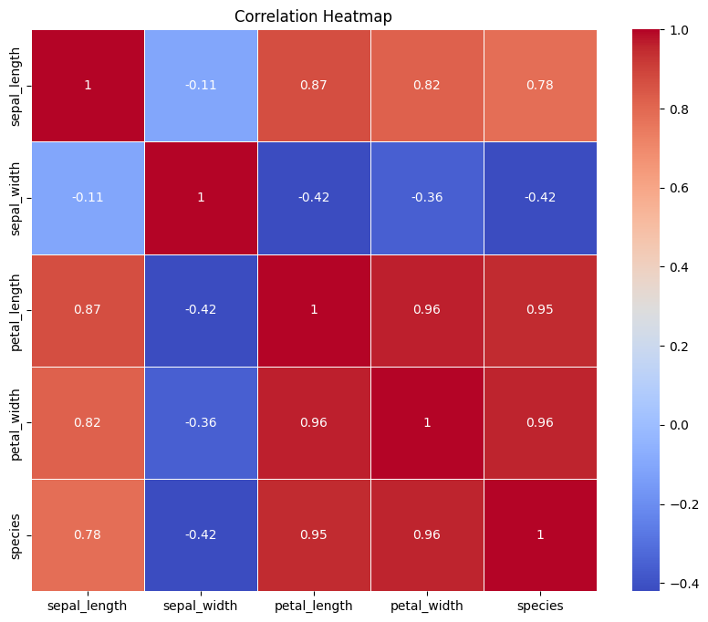
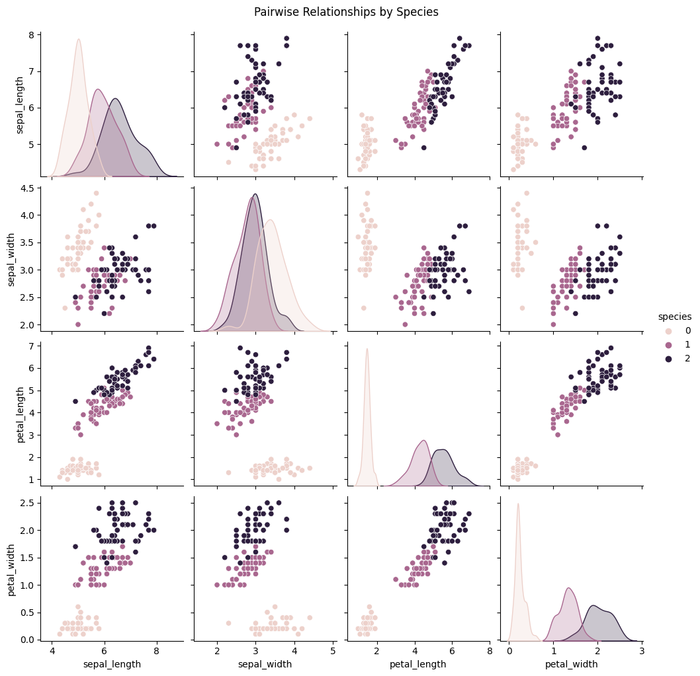

# Iris Flower Classification

This repository contains code and analysis for the Iris flower dataset. It includes Exploratory Data Analysis (EDA) on the Iris dataset and a classification model trained on the data.

## Files in the Repository

- `iris.csv`: The Iris dataset in CSV format.
- `EDA_iris.ipynb`: Jupyter notebook containing Exploratory Data Analysis on the Iris dataset.
- `classification_iris.ipynb`: Jupyter notebook containing code to parse the JSON file 'algo.json' and train the classification model.
- `algoparams_from_ui.json`: JSON file containing algorithm parameters for the classification model.
- `README.md`: This file, providing an overview of the repository and its contents.

## Exploratory Data Analysis (EDA)

The EDA.ipynb notebook contains detailed analysis and insights gained from the Iris dataset. The notebook performs the following tasks:

1. Loads the Iris dataset from `iris.csv`.
2. Cleans the data (if required) and handles missing values.
3. Computes summary statistics of the data.
4. Plots histograms and boxplots to visualize the distributions of features.
5. Calculates the correlation matrix and creates a heatmap to visualize correlations between features.
6. Generates pair plots to visualize relationships between numerical features.

### Insights from EDA

- The heatmap reveals strong positive correlations between:
  - Sepal length and petal length
  - Sepal length and petal width
  - Petal length and petal width

- A strong positive correlation is also observed between petal length and petal width, indicating that longer petals tend to be wider.

- Weak negative correlations are observed between:
  - Sepal width and petal length
  - Sepal width and petal width

- No strong correlation is found between sepal width and sepal length.

- The pair plots show scatter plots for all combinations of numerical features, helping identify patterns and trends between variables.

## Classification Model

The `classification_iris.ipynb` notebook contains code to parse the JSON file 'algo.json', which stores algorithm parameters, and trains a classification model on the Iris dataset.

## How to Use

1. Clone the repository to your local machine.
2. Install the required libraries (e.g., pandas, seaborn, scikit-learn).
3. Open the `EDA.ipynb` and `classification_iris.ipynb` notebooks using Jupyter Notebook or Jupyter Lab to run and analyze the code.

## EDA Figures

### Heatmap

The heatmap displays the correlation matrix for the Iris dataset. It shows the strength and direction of the correlations between different numerical features. Strong positive correlations are observed between sepal length and petal length, sepal length and petal width, as well as petal length and petal width. Additionally, there are weak negative correlations between sepal width and petal length, and sepal width and petal width. No strong correlation is found between sepal width and sepal length.

### Pair Plot

The pair plot represents scatter plots for all combinations of numerical features in the Iris dataset. Each scatter plot helps visualize the relationships between two features. For instance, the scatter plot of sepal length versus petal length shows a strong positive correlation, indicating that as the sepal length increases, the petal length tends to increase as well. Similarly, the scatter plot of petal length versus petal width also reveals a strong positive correlation. The diagonal histograms show the distribution of each feature individually, and the off-diagonal scatter plots display the relationship between pairs of features.

## Author

Priti Gupta
